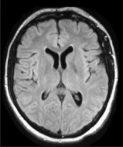
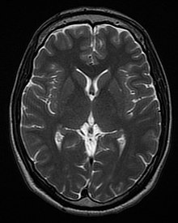

# MRI-Brain-Tumor-Detection
Python brain tumor detection model with an accuracy over 0.99, or 99%

Below are the outputs of tester.py, which ran the model on pred. 

- No Tumor Detected

- No Tumor Detected

- No Tumor Detected

- Tumor Detected

- No Tumor Detected

- Tumor Detected

- Tumor Detected

- No Tumor Detected

- Tumor Detected

- No Tumor Detected

- No Tumor Detected

- No Tumor Detected

- Tumor Detected

- No Tumor Detected

- No Tumor Detected

- No Tumor Detected

- Tumor Detected

- No Tumor Detected

- No Tumor Detected

- Tumor Detected

- No Tumor Detected

- Tumor Detected

- No Tumor Detected

- No Tumor Detected

- Tumor Detected

- No Tumor Detected

- No Tumor Detected

- Tumor Detected

- Tumor Detected

- No Tumor Detected

- No Tumor Detected

- No Tumor Detected

- No Tumor Detected

- Tumor Detected

- No Tumor Detected

- No Tumor Detected

- No Tumor Detected

- No Tumor Detected

- No Tumor Detected

- No Tumor Detected

- Tumor Detected

- No Tumor Detected

- No Tumor Detected

- No Tumor Detected

- No Tumor Detected

- Tumor Detected

- No Tumor Detected

- No Tumor Detected

- No Tumor Detected

- No Tumor Detected

- No Tumor Detected

- No Tumor Detected

- Tumor Detected

- No Tumor Detected

- No Tumor Detected

- No Tumor Detected

- Tumor Detected

- Tumor Detected

- Tumor Detected

- Tumor Detected
